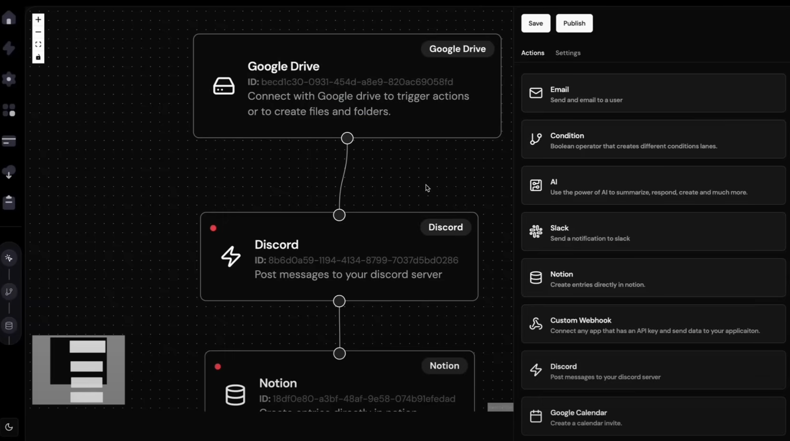

## 🛠 기술 스택

### 🚀 프레임워크 및 언어
- **Next.js 14**
- **React 18**
- **TypeScript**
  
### 🎨 UI & UX
- **Tailwind CSS + shadcn/ui**
- **reactflow**

### 🔒 인증 및 보안
- **@clerk/nextjs**

### 📦 데이터 관리 및 통신
- **Prisma + SQLite3** 
- **axios** 
- **uuid** 

### 🧩 상태 관리 및 폼 처리
- **Zustand** 
- **React Hook Form + Zod** 

### 🌐 외부 서비스 연동
- **@notionhq/client** – Notion API 연동
- **googleapis** – Google API 연동
- **@uploadcare/react-uploader** – Uploadcare를 통한 파일 업로드

# sreen

